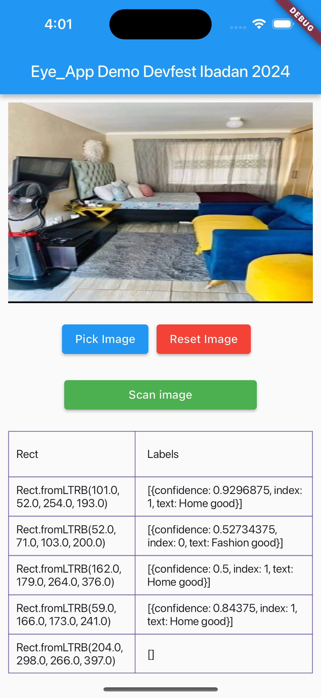
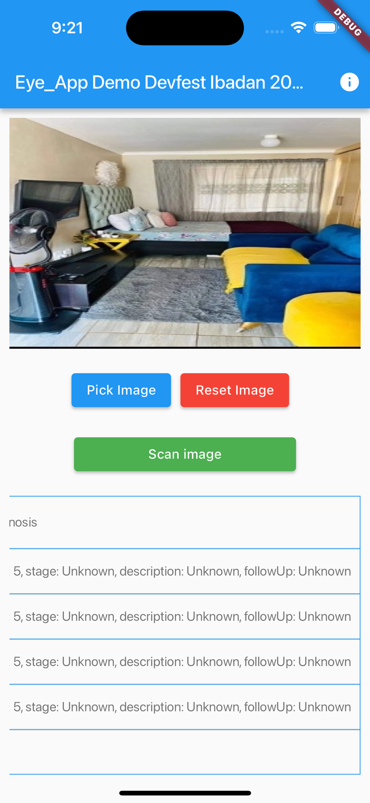

<div align="center">
   

## Eye_App_Demo_Devfest_Ibadan_2024

<strong>A multi-platform application (Android & iOS) showcasing automated detection and classification of images using a Firebase Machine learning kit and a locally stored machine learning model that can identify retinal images for patients with Diabetic Retinopathy</strong>

<sub>Built by <a href="https://twitter.com/_Captured_Heart">Nkpozi Marcel Kelechi</a></sub>
<br />

## AN INTRO VIDEO OF THE APP

</div>

---

## Getting Started

After cloning,

### FVM setup

it runs on flutter version: flutter: ">=3.22.0", dart: ">=3.4.1 <4.0.0",

Install `fvm` if not already installed.

```bash
dart pub global activate fvm
```

Install the local `flutter` version.

```bash
fvm install
```

### Plugins

- The [image_picker](https://pub.dev/packages/image_picker) requires microphone, camera and photo library permissions, remember to read the docs and configure properly
- The [image_cropper](https://pub.dev/packages/image_cropper) plugin requires configuration for Android
- The [google_mlkit_object_detection](https://pub.dev/packages/google_mlkit_object_detection) requires an upgrade of the iOS deployment target, READ THE DOCS!!!!

---

# Key Features

1. Pick image:

   - Utilizes the "image_picker" and "image_cropper" plugins to select image for Object detction and labelling

2. Object Detection and Labelling:

   - Utilizes the "google_mlkit_object_detection" plugin to analyze images, detect rects and give labels

3. Local Custom Model

   - Supports Object labelling via a custom local model in the assets folder

## UI Shots

<div style="text-align: center">
  <table>
    <tr>
      <td style="text-align: center">
        
      </td>
      <td style="text-align: center">
        
      </td>
    </tr>
  </table>
</div>

## Tools

- [google_mlkit_object_detection](https://pub.dev/packages/google_mlkit_object_detection): A Flutter plugin to use Google's ML Kit Object Detection and Tracking to detect and track objects in an image or live camera feed.

- [image_picker](https://pub.dev/packages/image_picker): A Flutter plugin for iOS and Android for picking images from the image library, and taking new pictures with the camera.

- [image_cropper](https://pub.dev/packages/image_cropper): A Flutter plugin for Android, iOS and Web supports cropping images.

- [path_provider](https://pub.dev/packages/path_provider): A Flutter plugin for finding commonly used locations on the filesystem.
